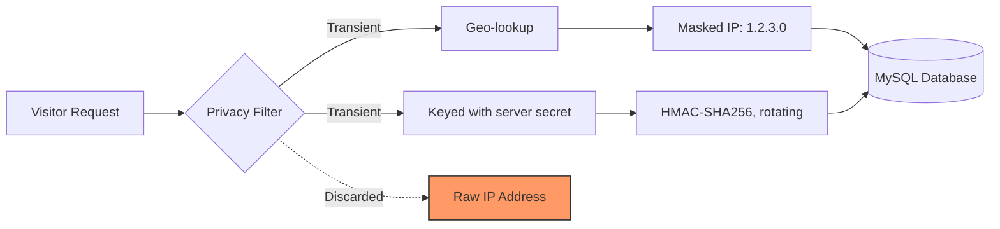

# ViewCounter

[](https://harshankur.github.io/viewcounter/)
[](LICENSE)
[](https://github.com/harshankur/viewcounter/actions/workflows/ci.yml)
[](TEST_REPORT.md)

A comprehensive Node.js/Express analytics server for tracking website views with MySQL storage, featuring auto-database creation, advanced tracking, and rich analytics.

## 📖 Documentation
Visit our [Interactive Documentation](https://harshankur.github.io/viewcounter/) for detailed API specifications, debugging tips, and integration guides.

## 🛡️ GDPR Compliant & Privacy-First
**100% GDPR Compliant By Design.** This project is built from the ground up to respect user privacy and adhere to modern ethical standards:
- **Zero Cookies**: No cookies, no local storage, and no consent banners required.
- **Data Sovereignty**: You own your data. Analytics never leave your private infrastructure.
- **Minimal Collection**: Tracks only what is necessary (Country, Browser, OS, Page Path).

### 🔄 Data Privacy Lifecycle


### 🧬 What happens to the IP?
We believe in total transparency regarding your visitors' data:
1. **Transient Use Only**: The raw IP address is used only in memory, for the country lookup and for deriving the visitor hash. It is never written to the database, and log lines record the *masked* address.
2. **Immediate Masking**: Before being saved, the IP is masked (IPv4 last octet zeroed; IPv6 interface identifier zeroed).
3. **Keyed, Not Just Hashed**: The visitor identifier is an HMAC-SHA-256 keyed with a 32-byte server secret generated on first run and stored at mode `0600`. This matters: an *unkeyed* hash of an IP is reversible by exhausting the 2^32 IPv4 space, which takes about an hour on one CPU core. Without the secret, that search is infeasible.
4. **Rotating**: The hash also mixes in a time window (`UNIQUE_VISITOR_WINDOW_HOURS`), so the same visitor hashes differently after each window and their visits cannot be linked over time.
5. **Automated Guards**: [`tests/privacyFailSafe.test.js`](tests/privacyFailSafe.test.js) asserts that no raw IP or User-Agent reaches either the bound parameters *or* the SQL text of any statement, and that the hash is genuinely keyed. CI runs it on every push, so a change that started storing raw IPs would fail the build.

## ✨ Features

### Core Capabilities
- 🔒 **Security**: Prepared statements, rate limiting, Helmet.js, input validation
- ⚡ **Performance**: Connection pooling with mysql2, duplicate prevention
- 🗄️ **Flexible Database**: Connect to existing DB or auto-create schema
- 🛠️ **Easy Setup**: Interactive CLI wizard with config detection
- 🏥 **Production-Ready**: Health checks, graceful shutdown, structured logging

### Advanced Tracking
- 📍 **Page Tracking**: Track specific pages/paths, not just app-level
- 🔗 **Referrer Analysis**: Automatic source categorization (search, social, email, campaign, referral, direct)
- 🖥️ **User Agent Parsing**: Browser, OS, and device type detection
- 👤 **Session Tracking**: Group views by user session
- 🎯 **Custom Events**: Track button clicks, form submissions, etc.
- 📊 **Time-Based Analytics**: Hourly, daily, and weekly trends

## Quick Start

### 1. Install Dependencies
```bash
npm install
```

### 2. Run Setup Wizard
```bash
npm run setup
```

The wizard will:
- Detect existing configuration (if any)
- Guide you through database setup (connect vs. create mode)
- Configure allowed app IDs and device sizes
- Optionally create `.env` file

### 3. Start Server
```bash
npm start
```

## Configuration

### Database Modes

**Connect Mode** (default): Use existing database
```json
// dbInfo.json
{
    "mode": "connect",
    "host": "127.0.0.1",
    "database": "viewcounterdb",
    "user": "root",
    "password": "your_password"
}
```

**Create Mode**: Auto-create database and tables
```json
// dbInfo.json
{
    "mode": "create",
    "host": "127.0.0.1",
    "database": "viewcounterdb",
    "user": "root",
    "password": "your_password"
}
```

### Allowed Values
```json
// allowed.json
{
    "appId": ["blog", "portfolio"],
    "deviceSize": ["small", "medium", "large"]
}
```

### Environment Variables
See [`.env.example`](.env.example) for the full surface with prose on each one.

**Required in production** — the server refuses to start without these rather
than running on a guessable default:
- `DB_USER` / `DB_PASSWORD`: refuses to boot while still `root` with an empty password
- `DB_NAME`: database to write into
- `ALLOWED_APP_IDS` (or `allowed.json`): the placeholder `example_app` is rejected
- `CORS_ORIGINS`: browser origins allowed to call the write endpoints

**Recommended**:
- `READ_API_KEYS`: comma-separated keys for the analytics read endpoints. Unset means the read API is disabled.
- `TRUST_PROXY`: hop count or CIDR list. **Never set this to `true`** — trusting every hop lets any caller forge their own IP via `X-Forwarded-For`, which fakes geolocation, inflates unique-visitor counts, and bypasses rate limiting. `true` and `*` are downgraded to one hop with a warning. Your proxy must set `X-Forwarded-For`; `X-Real-IP` alone is not read.
- `VISITOR_SECRET_PATH` / `VISITOR_SECRET`: where the visitor-hash secret lives, or the value itself.

**Optional**: `DB_MODE`, `PORT`, `LOG_LEVEL`, `RATE_LIMIT_WINDOW_MS`,
`RATE_LIMIT_MAX`, `UNIQUE_VISITOR_WINDOW_HOURS`, `ALLOWED_DEVICE_SIZES`.

## API Endpoints

### 📊 Tracking

#### Register View (Enhanced)
```bash
# Basic (backward compatible)
GET /registerView?appId=blog&deviceSize=medium

# Enhanced with page tracking
GET /registerView?appId=blog&deviceSize=medium&page=/blog/my-post&title=My%20Post

# With referrer and session
GET /registerView?appId=blog&deviceSize=medium&page=/blog/my-post&referrer=https://google.com&sessionId=abc123
```

**Automatic tracking:**
- ✅ IP address and geolocation
- ✅ Browser, OS, device type (from User-Agent)
- ✅ Referrer domain and source type
- ✅ Duplicate prevention (configurable window)

**Response**: 
```json
{"message": "Success!", "duplicate": false}
```

#### Track Custom Event
```bash
POST /event
Content-Type: application/json

{
  "appId": "blog",
  "eventType": "button_click",
  "eventData": {"button": "subscribe", "location": "header"},
  "sessionId": "abc123",
  "page": "/blog/my-post"
}
```

### 📈 Analytics

> **These endpoints require authentication.** They return your analytics data,
> so every one of them expects a valid key in the `x-api-key` header. Configure
> keys via `READ_API_KEYS` (comma-separated, minimum 32 characters each). With
> none configured the read API returns `503` — it fails closed rather than
> serving your data to anyone who asks.
>
> ```bash
> curl -H "x-api-key: $VIEWCOUNTER_KEY" https://your-server.com/stats/blog
> ```
>
> The tracking endpoints above stay public by design: a browser on your site has
> to be able to reach them. They are bounded by validation, rate limiting, and
> per-app origin binding instead.


#### Get Statistics
```bash
GET /stats/:appId
```
**Response**:
```json
{
  "appId": "blog",
  "stats": {
    "total": 1523,
    "uniqueVisitors": 892,
    "last24Hours": 47,
    "byCountry": [{"country": "US", "count": 423}],
    "byDevice": [{"devicesize": "medium", "count": 789}]
  }
}
```

#### Get Trends
```bash
# Daily trends for last 30 days
GET /trends/:appId?period=daily&days=30

# Hourly trends for last 7 days
GET /trends/:appId?period=hourly&days=7

# Weekly trends for last 12 weeks
GET /trends/:appId?period=weekly&days=84
```

**Response**:
```json
{
  "appId": "blog",
  "period": "daily",
  "days": 30,
  "trends": [
    {"period": "2026-01-01", "count": 45},
    {"period": "2026-01-02", "count": 52}
  ]
}
```

#### Get Referrer Statistics
```bash
GET /referrers/:appId?limit=20
```

**Response**:
```json
{
  "appId": "blog",
  "bySource": [
    {"source_type": "search", "count": 450},
    {"source_type": "social", "count": 230},
    {"source_type": "direct", "count": 180}
  ],
  "byDomain": [
    {"referrer_domain": "google.com", "count": 320},
    {"referrer_domain": "twitter.com", "count": 150}
  ]
}
```

#### Get Browser/OS Statistics
```bash
GET /browsers/:appId
```

**Response**:
```json
{
  "appId": "blog",
  "byBrowser": [
    {"browser": "Chrome", "count": 650},
    {"browser": "Safari", "count": 320}
  ],
  "byOS": [
    {"os": "Windows", "count": 550},
    {"os": "Mac OS", "count": 380}
  ],
  "byDeviceType": [
    {"device_type": "desktop", "count": 890},
    {"device_type": "mobile", "count": 450}
  ]
}
```

#### Get Page Statistics
```bash
GET /pages/:appId?limit=20
```

**Response**:
```json
{
  "appId": "blog",
  "pages": [
    {"page_path": "/blog/post-1", "page_title": "My First Post", "views": 234},
    {"page_path": "/blog/post-2", "page_title": "Second Post", "views": 189}
  ]
}
```

#### Get Session Details
```bash
GET /sessions/:appId/:sessionId
```

**Response**:
```json
{
  "appId": "blog",
  "sessionId": "abc123",
  "events": [
    {
      "id": 1,
      "event_type": "pageview",
      "page_path": "/blog/post-1",
      "timestamp": "2026-01-09T21:30:00.000Z"
    },
    {
      "id": 2,
      "event_type": "button_click",
      "event_data": {"button": "subscribe"},
      "timestamp": "2026-01-09T21:31:15.000Z"
    }
  ],
  "count": 2
}
```

#### Get Recent Views
```bash
GET /views/:appId?limit=10&offset=0
```

#### List Apps
```bash
GET /apps                       # requires x-api-key; filtered to the key's scope
```

#### Register an App
```bash
POST /apps                      # requires an ADMIN x-api-key
Content-Type: application/json

{ "appId": "newcustomer", "origins": ["https://newcustomer.example"] }
```
Creates the table and adds the app to the live allowlist without a restart.

#### Health Check
```bash
GET /health                     # public; reports liveness only
```

## Deployment

### Production with nohup
```bash
nohup node index.js > stdout.log &
# Kill with: kill <pid>
```

### Environment Variables
Set `NODE_ENV=production` to hide error details in API responses.

## What Gets Tracked?

For each view/event, the system automatically captures:

| Field | Source | Description |
|-------|--------|-------------|
| **IP Address** | Request | Visitor IP |
| **Country** | GeoIP lookup | 2-letter country code |
| **Timestamp** | Server | When the event occurred |
| **Device Size** | Query param | small, medium, large |
| **Page Path** | Query param (optional) | e.g., `/blog/my-post` |
| **Page Title** | Query param (optional) | e.g., "My Blog Post" |
| **Referrer** | Header/query (optional) | Full referrer URL |
| **Referrer Domain** | Parsed | e.g., `google.com` |
| **Source Type** | Parsed | search, social, email, campaign, referral, direct |
| **Browser** | User-Agent | e.g., Chrome, Safari, Firefox |
| **Browser Version** | User-Agent | e.g., 120.0 |
| **OS** | User-Agent | e.g., Windows, Mac OS, Linux |
| **OS Version** | User-Agent | e.g., 10, 14.2 |
| **Device Type** | User-Agent | desktop, mobile, tablet, tv, console |
| **Session ID** | Query param (optional) | Group events by session |
| **Event Type** | Query param/body | pageview, click, submit, etc. |
| **Event Data** | Body (optional) | Custom JSON data |

## Understanding `UNIQUE_VISITOR_WINDOW_HOURS`

This setting prevents counting the same visitor multiple times within a time window.

**How it works:**
- When a view is registered, the system checks if the same IP has visited within the last X hours
- If yes: Returns `{duplicate: true}` (doesn't count again)
- If no: Inserts new view

**Examples:**
- `24` (default): Same IP counts as 1 view per day
- `0`: Disable duplicate prevention (count every request)
- `168`: Same IP counts as 1 view per week

**Note:** Only applies to `pageview` events, not custom events.

### 🛡️ Privacy Guardrails (Fail-Safe)
To guarantee that raw IPs never leak into the database, we've implemented an automated **Privacy Guard** suite ([privacyFailSafe.test.js](file:///Users/harshankur/Desktop/codes/viewcounter/tests/privacyFailSafe.test.js)):
- **Query Interception**: Every single SQL `INSERT` is intercepted during tests.
- **Regex Scanning**: We scan all query parameters against raw IP patterns (IPv4 and IPv6).
- **Hard Enforcement**: If the system ever attempts to save an unmasked IP, the test suite immediately fails, preventing accidental privacy regressions.

This makes ViewCounter not just "Privacy-First" by design, but **Privacy-Guaranteed** by automation.

- [x] Implement IP masking utility
- [x] Implement transient hashing for uniqueness
- [x] Update `DatabaseManager` to use hashes/masked IPs
- [x] Update `db/schema.sql` (column renaming/clarification)
- [x] Remove "IP Address" references from docs/README
- [x] Update documentation with "How it works" privacy section
- [x] Update and verify tests

## Security Features

**Trust model.** The two write endpoints (`/registerView`, `/event`) are public
because a browser on your site must be able to reach them. Everything that
*reads* analytics is authenticated.

- ✅ **Authenticated, scoped read API** — every analytics endpoint requires `x-api-key`, compared in constant time, and each key is authorized against the specific `appId` requested. Fails closed when unconfigured.
- ✅ **Separate admin tier** — provisioning apps uses its own credential; a read key cannot provision and an admin key cannot read.
- ✅ **Per-tenant rate limits** — an `appId`-keyed budget alongside the per-IP limit.
- ✅ **Keyed visitor hashing** — HMAC-SHA-256 with a persisted 32-byte server secret, rotating per window, so stored hashes are not reversible to an IP.
- ✅ **SQL injection prevention** — every value is a bound parameter; the only interpolated identifier is `appId`, gated by the allowlist.
- ✅ **Explicit CORS allowlist** — no wildcard, and writes can be bound to registered origins per app.
- ✅ **Proxy-aware IP derivation** — client-supplied forwarding headers are not trusted unless `TRUST_PROXY` says so.
- ✅ **Bounded input** — length caps matching every column width, integer ranges on `limit`/`days`/`offset`, a 16 kB body cap and a 4 kB `eventData` cap.
- ✅ **Resource guards** — finite pool queue, per-statement timeout, rate limiting.
- ✅ **No error leakage** — failures return a request id; the detail goes only to the server log.
- ✅ **Security headers** (Helmet.js) and `Cache-Control: no-store` on all analytics responses.
- ✅ **Fail-fast config validation** — insecure defaults stop the boot rather than being silently accepted.
- ✅ **Adversarial regression suite** — [`tests/security.test.js`](tests/security.test.js) covers header spoofing, auth bypass, injection-shaped input, oversized payloads, and prototype pollution.

Report a vulnerability through [private advisory reporting](https://github.com/harshankur/viewcounter/security/advisories/new), not a public issue. See [SECURITY.md](SECURITY.md).

## Usage Patterns

### The deciding question: who holds the visitor's IP?

This determines whether an integration works or silently produces garbage.

**The browser calls ViewCounter directly.** It sees the real visitor IP, so
masking, geolocation, and the visitor hash all work. This is the intended path.

**Your server calls on the visitor's behalf** (SSR, a proxy route, a backend
hook). ViewCounter sees *your server's* address, so every visitor hashes
identically: unique visitors collapses to 1 and geo reports your datacenter
forever. Total views still count. If you must do this, forward the real address
and tell ViewCounter to believe you:

```
X-Forwarded-For: <real visitor IP>     # set by your code
TRUST_PROXY=1                          # otherwise the header is ignored
```

**A process with no visitor at all** (cron, CLI, worker, webhook) should use
`POST /event`. Custom events are never deduplicated, so "unique visitors" is
simply not a meaningful column for those rows.

### Self-hosted blogs

One snippet in the layout every page includes.

| Platform | Where it goes |
|---|---|
| Hugo, Jekyll, Eleventy, Astro | `baseof.html` / `_layouts/default.html` / base layout |
| Ghost | Settings → Code injection → Site Footer |
| WordPress | `wp_footer` hook in the theme, or a small plugin |
| Docusaurus, MkDocs | theme footer partial |
| Next.js, Nuxt, SvelteKit | root layout, **plus a router hook** |

Static generators are the easy case: every navigation is a real page load, so
one fetch in the layout is complete coverage.

**SPAs are the trap.** Client-side routing fires no page load, so you record the
entry page and nothing else. Track again on route change:

```js
router.afterEach(() => track());        // Vue / Nuxt
useEffect(() => track(), [pathname]);   // Next.js app router
```

Run one instance for all your sites — one `appId` each, each with its own table
and its own origin list.

## Multi-Tenancy

Each `appId` is a tenant: its own table, its own origin allowlist, its own
request budget, and its own read credentials.

**`appId` is not a secret.** It travels in a URL the browser fetches, so anyone
can read it from your page source. What stops a stranger writing into your table
is the `origins` list, not the ID being unguessable. Configure origins per app.

### Scoped read keys

A key maps to the apps it may read. Keys in `READ_API_KEYS` are unscoped (they
read everything, which is what you want when all the apps are yours). Scoped
keys live in `allowed.json`:

```json
{
  "appId": ["acme", "globex"],
  "origins": {
    "acme":   ["https://acme.example"],
    "globex": ["https://globex.example"]
  },
  "apiKeys": {
    "<32+ char key for acme>":   ["acme"],
    "<32+ char key for globex>": ["globex"],
    "<32+ char key for you>":    "*"
  }
}
```

Acme's key on `GET /stats/globex` returns **403**. `GET /apps` returns only the
apps in the presented key's scope, so the listing cannot be used to discover
which other tenants exist. A nonexistent app returns the same 403 as an
out-of-scope one, for the same reason.

### Provisioning a tenant at runtime

`POST /apps` creates the app's table, records it, and adds it to the live
allowlist — no restart, no config edit. It requires an **admin** key
(`ADMIN_API_KEYS`), which is a separate tier: a read key cannot provision, and
an admin key cannot read analytics.

```bash
curl -X POST https://your-server.com/apps \
  -H "x-api-key: $VIEWCOUNTER_ADMIN_KEY" \
  -H "Content-Type: application/json" \
  -d '{"appId": "newcustomer", "origins": ["https://newcustomer.example"]}'
```

Registered apps live in an `_apps` table and are reloaded on every boot, so they
survive restarts. Re-registering is idempotent.

The `appId` becomes a MySQL table name, so it is restricted to 1–64 characters
of letters, digits, underscore, and hyphen, and may not start with an underscore
(reserved for internal tables). Anything else is rejected with 422.

### Per-tenant request budgets

Two independent limits apply to writes:

- `RATE_LIMIT_MAX` — per client IP. The single-abuser backstop.
- `APP_RATE_LIMIT_MAX` — per `appId`. Stops one tenant consuming the budget
  everyone else on the instance depends on. Keyed on `appId` alone, so it cannot
  be bypassed by rotating addresses. Set `0` to disable for single-tenant use.

### What is still yours to build

Tenancy here is data isolation and quota, not a billing system. There is no
usage metering, no plan enforcement, and no self-serve signup flow — `POST /apps`
is an admin action you would call from your own onboarding code.

## Deployment Modes

ViewCounter can run three ways. All three share the same route layer
([`routes/analytics.js`](routes/analytics.js)), so behaviour is identical.

### 1. Standalone server

The default. Runs its own Express app on its own port.

```bash
npm start                       # listens on PORT (default 3030)
```

### 2. Mounted as Express middleware

Mount the router into an application you already have, under any path prefix.
Useful when you would rather not run and reverse-proxy a second service.

```js
const express = require('express');
const { createAnalyticsRouter, DatabaseManager } = require('viewcounter');

const app = express();
app.use(express.json({ limit: '16kb' }));

const dbManager = new DatabaseManager({
  mode: 'connect',
  host: '127.0.0.1',
  port: 3306,
  database: 'viewcounterdb',
  user: process.env.DB_USER,
  password: process.env.DB_PASSWORD,
});
await dbManager.initialize(['blog']);

app.use('/analytics', createAnalyticsRouter({
  dbManager,
  config: {
    allowed: { appId: ['blog'], deviceSize: ['small', 'medium', 'large'], origins: {} },
    auth:    { readApiKeys: [process.env.VIEWCOUNTER_KEY] },
    privacy: { visitorSecret: process.env.VISITOR_SECRET },
    server:  { uniqueVisitorWindowHours: 24 },
  },
}));
```

Endpoints then live under the prefix — `POST /analytics/event`,
`GET /analytics/stats/blog`, and so on.

Two things the host application owns in this mode, because the router does not
install them itself: `helmet()` and the CORS allowlist, and `trust proxy`. Set
`app.set('trust proxy', <hop count>)` — never `true`, or callers can forge
their own IP through `X-Forwarded-For`.

### 3. Browser client

There is no published client package yet; the snippets below are the
integration surface. See [Client-Side Integration](#client-side-integration).

## Client-Side Integration

### Basic Tracking
```html
<script>
  // Track page view
  fetch('https://your-server.com/registerView?appId=blog&deviceSize=medium');
</script>
```

### Enhanced Tracking
```javascript
// Generate a session ID (store in sessionStorage).
// Use crypto.randomUUID(), not Math.random(): Math.random() is not a CSPRNG,
// its output is short and predictable, and collisions merge two visitors'
// sessions into one.
const sessionId = sessionStorage.getItem('sessionId') || crypto.randomUUID();
sessionStorage.setItem('sessionId', sessionId);

// Track page view with full context
fetch(`https://your-server.com/registerView?` + new URLSearchParams({
  appId: 'blog',
  deviceSize: window.innerWidth < 768 ? 'small' : 
               window.innerWidth < 1200 ? 'medium' : 'large',
  page: window.location.pathname,
  title: document.title,
  referrer: document.referrer,
  sessionId: sessionId
}));
```

### Track Custom Events
```javascript
async function trackEvent(eventType, eventData) {
  await fetch('https://your-server.com/event', {
    method: 'POST',
    headers: {'Content-Type': 'application/json'},
    body: JSON.stringify({
      appId: 'blog',
      eventType,
      eventData,
      sessionId: sessionStorage.getItem('sessionId'),
      page: window.location.pathname
    })
  });
}

// Track button click
document.querySelector('#subscribe-btn').addEventListener('click', () => {
  trackEvent('button_click', {button: 'subscribe', location: 'header'});
});
```

## Testing

### Running Tests

```bash
# Run all tests with coverage (auto-generates TEST_REPORT.md)
npm test

# Run tests in watch mode (for development)
npm run test:watch

# Run tests and persist database for inspection
npm run test:persist

# Run tests for CI/CD (no report generation)
npm run test:ci
```

### Test Database

**Automatic Management:**
- ✅ Creates fresh `viewcounterdb_test` database before each test run
- ✅ Populates with realistic test data
- ✅ Automatically cleaned up after tests complete

**Persist Database for Debugging:**
```bash
# Keep test database after tests
npm run test:persist

# Or set environment variable
PERSIST_TEST_DB=true npm test
```

When persisted, you can inspect the database:
```sql
USE viewcounterdb_test;
SHOW TABLES;
SELECT * FROM test_app_1;
```

To manually remove:
```sql
DROP DATABASE viewcounterdb_test;
```

### Test Reports

**Automatically generated after every test run:**
- ✅ **Terminal output**: Immediate test results and coverage
- ✅ **TEST_REPORT.md**: Comprehensive markdown summary (auto-generated)
- ✅ **test-report.html**: Visual test results with dark theme
- ✅ **coverage/index.html**: Interactive code coverage report

All reports are created in the project root directory.

### Test Coverage

The test suite includes:

#### Unit Tests
- ✅ **UserAgentParser**: Browser, OS, and device detection
- ✅ **ReferrerParser**: Traffic source categorization

#### Integration Tests
- ✅ **Health Check**: Server status monitoring
- ✅ **View Registration**: Basic and enhanced tracking
- ✅ **Custom Events**: Event tracking with metadata
- ✅ **Statistics**: Aggregated analytics
- ✅ **Trends**: Time-based analytics
- ✅ **Referrers**: Traffic source analysis
- ✅ **Browsers**: Browser/OS/device breakdown
- ✅ **Pages**: Page view statistics
- ✅ **Sessions**: Session journey tracking
- ✅ **Rate Limiting**: Request throttling

### Test Scenarios

All endpoints are tested with:
- ✓ Valid inputs
- ✓ Invalid inputs
- ✓ Missing parameters
- ✓ Edge cases
- ✓ Security validation

## License

[MIT](LICENSE) - Do whatever you want with this, just don't sue us.