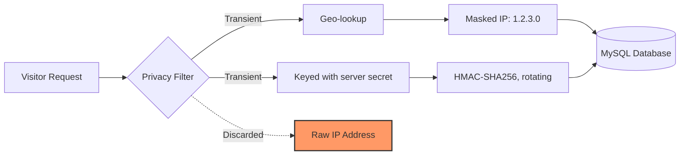

# ViewCounter

[](https://viewcounter.harshankur.com)
[](LICENSE)
[](https://github.com/harshankur/viewcounter/actions/workflows/test.yml)
[](TEST_REPORT.md)
[](https://www.npmjs.com/package/@harshankur/viewcounter)
[](https://www.npmjs.com/package/@harshankur/viewcounter#provenance)

A comprehensive Node.js/Express analytics server for tracking website views with MySQL storage, featuring auto-database creation, advanced tracking, and rich analytics.

## 📖 Documentation
Visit our [Interactive Documentation](https://viewcounter.harshankur.com) for detailed API specifications, debugging tips, and integration guides.

## 🛡️ GDPR Compliant & Privacy-First
**100% GDPR Compliant By Design.** This project is built from the ground up to respect user privacy and adhere to modern ethical standards:
- **Nothing on the visitor's device**: no cookie, no localStorage, no sessionStorage, and no identifier sent with a view, so the tracker needs no consent banner under the ePrivacy rules on device storage. (The optional admin UI signs its operator in with a session cookie; tracking never sets one.)
- **Data Sovereignty**: You own your data. Analytics never leave your private infrastructure.
- **Minimal Collection**: records what analytics needs, each in a form that does not identify a person. [What Gets Tracked?](#what-gets-tracked) lists every field, where it comes from, and how it is stored; the raw IP address, the user agent, and the query string are never stored.
- **Bots left out**: crawlers, link previewers, and automated browsers are recognised and never stored, only counted per minute by name.

### 🔄 Data Privacy Lifecycle

```mermaid
graph LR
    A[Visitor Request] --> B{Privacy Filter}
    B -->|Transient| C[Geo-lookup]
    B -->|Transient| D[Keyed with server secret]
    C --> E[Masked IP: 1.2.3.0]
    D --> F[HMAC-SHA256, rotating]
    E --> G[(MySQL Database)]
    F --> G
    B -.->|Discarded| H[Raw IP Address]
    style H fill:#f96,stroke:#333,stroke-width:2px
```

### 🧬 What happens to the IP?
We believe in total transparency regarding your visitors' data:
1. **Transient Use Only**: The raw IP address is used only in memory, for the country lookup and for deriving the visitor hash. It is never written to the database, and log lines record the *masked* address.
2. **Immediate Masking**: Before being saved, the IP is masked (IPv4 last octet zeroed; IPv6 interface identifier zeroed).
3. **Keyed, Not Just Hashed**: The visitor identifier is an HMAC-SHA-256 keyed with a 32-byte server secret generated on first run and stored at mode `0600`. This matters: an *unkeyed* hash of an IP is reversible by exhausting the 2^32 IPv4 space, which takes about an hour on one CPU core. Without the secret, that search is infeasible.
4. **Rotating**: The hash also mixes in a time window (`UNIQUE_VISITOR_WINDOW_HOURS`), so the same visitor hashes differently after each window and their visits cannot be linked over time.
5. **Automated Guards**: [`tests/privacyFailSafe.test.js`](tests/privacyFailSafe.test.js) asserts that no raw IP or User-Agent reaches either the bound parameters *or* the SQL text of any statement, and that the hash is genuinely keyed. CI runs it on every push, so a change that started storing raw IPs would fail the build.

## ✨ Features

### Core Capabilities
- 🔒 **Security**: Prepared statements, rate limiting, Helmet.js, input validation
- ⚡ **Performance**: Connection pooling with mysql2, duplicate prevention
- 🗄️ **Flexible Database**: Connect to existing DB or auto-create schema
- 🛠️ **Easy Setup**: Interactive CLI wizard with config detection
- 🏥 **Production-Ready**: Health checks, graceful shutdown, structured logging
- 🧑‍💼 **Admin UI**: Browse, search, edit, annotate, and soft-delete recorded views, with batch actions, a trash, and audit logs ([details](#admin-ui))

### Advanced Tracking
- 🧩 **Tracker script**: one `<script>` tag, served by your ViewCounter server ([details](#client-side-integration)): page views, including page changes in single-page apps; how long each page was visible and how far it was scrolled; clicks on links to other sites and on downloads; campaign tags. It stores nothing on the device.
- 📍 **Pages and sites**: the page path, its title, and which of your sites (hostname) it was on
- 🔗 **Referrer Analysis**: automatic source categorization (search, social, email, campaign, referral, internal, direct)
- 🏷️ **Campaigns**: the five `utm_*` tags of the landing URL, and nothing else from it
- 🌍 **Location**: country built in; region and city with an optional [city database](#location-data)
- 🗣️ **Language**: the visitor's preferred language (its primary subtag only, such as `de`)
- 🖥️ **User Agent Parsing**: browser, OS, and device type, with their versions
- ⏱️ **Engagement**: time on page and scroll depth, measured by the tracker script
- 🎯 **Custom Events**: track button clicks, form submissions, etc., with properties
- 📊 **Analysis**: visitors, visits, bounce rate, visit duration, entry and exit pages, page flow, a weekday-by-hour heatmap, and comparisons with the period before, in the [admin UI](#admin-ui)

## Quick Start

**Requires Node 24 or newer** and a reachable MySQL 8 (or MariaDB 11) instance.
Only the current Node LTS is supported, with no matrix of older runtimes to
maintain.

### 1. Install Dependencies
```bash
npm install
```

### 2. Run Setup Wizard
```bash
npm run setup
```

The wizard will:
- Detect existing configuration (if any)
- Guide you through database setup (connect vs. create mode)
- Configure allowed app IDs and device sizes
- Optionally create `.env` file

### 3. Start Server
```bash
npm start
```

## Configuration

### Database Modes

**Connect Mode** (default): Use existing database
```json
// dbInfo.json
{
    "mode": "connect",
    "host": "127.0.0.1",
    "database": "viewcounterdb",
    "user": "root",
    "password": "your_password"
}
```

On every start, in either mode, the server brings each app table up to the
current schema and creates the log tables it needs, so the user needs `CREATE`,
`ALTER`, and `INDEX` on the database as well as `SELECT`, `INSERT`, `UPDATE`,
and `DELETE`. A user limited to reads and writes, which was enough before 3.1,
fails startup with `MIGRATION_FAILED`. Grant these before upgrading:

```sql
GRANT SELECT, INSERT, UPDATE, DELETE, CREATE, ALTER, INDEX ON viewcounterdb.* TO 'vcuser'@'%';
```

**Create Mode**: Auto-create database and tables
```json
// dbInfo.json
{
    "mode": "create",
    "host": "127.0.0.1",
    "database": "viewcounterdb",
    "user": "root",
    "password": "your_password"
}
```

### Allowed Values
```json
// allowed.json
{
    "appId": ["blog", "portfolio"],
    "deviceSize": ["small", "medium", "large"]
}
```

### Environment Variables
See [`.env.example`](.env.example) for the full surface with prose on each one.

**Required in production**: the server refuses to start without these rather
than running on a guessable default:
- `DB_USER` / `DB_PASSWORD`: refuses to boot while still `root` with an empty password
- `DB_NAME`: database to write into
- `ALLOWED_APP_IDS` (or `allowed.json`): the placeholder `example_app` is rejected
- `CORS_ORIGINS`: browser origins allowed to call the write endpoints

**Recommended**:
- `READ_API_KEYS`: comma-separated keys for the analytics read endpoints. Unset means the read API is disabled.
- `TRUST_PROXY`: hop count or CIDR list. **Never set this to `true`**: trusting every hop lets any caller forge their own IP via `X-Forwarded-For`, which fakes geolocation, inflates unique-visitor counts, and bypasses rate limiting. `true` and `*` are downgraded to one hop with a warning. Your proxy must set `X-Forwarded-For`; `X-Real-IP` alone is not read.
- `VISITOR_SECRET_PATH` / `VISITOR_SECRET`: where the visitor-hash secret lives, or the value itself.
- `ADMIN_PASSWORD`: turns on the [admin UI](#admin-ui) at `/admin`. At least 16 characters. Unset means the admin UI does not exist.

**Optional**: `DB_MODE`, `PORT`, `LOG_LEVEL`, `RATE_LIMIT_WINDOW_MS`,
`RATE_LIMIT_MAX`, `UNIQUE_VISITOR_WINDOW_HOURS`, `ALLOWED_DEVICE_SIZES`,
`TRASH_RETENTION_DAYS`, `VIEW_LOG_RETENTION_DAYS`, `ADMIN_SESSION_IDLE_TIMEOUT`,
`ADMIN_SESSION_MAX_AGE`, `GEOIP_CITY_DB`.

### Time zones

Views are timestamped by the database (`NOW()`), and the admin analysis groups
them into UTC days and hours whatever the database's time zone. Run ViewCounter
and the database in the same time zone, so times read back unchanged; in
containers both default to UTC.

### Location data

**Country** comes from the GeoLite2 country database bundled in the
`geoip-country` package: nothing to configure. MaxMind updates it monthly and
the package follows, so update the package (or rebuild your image) now and
then. GeoLite2's licence asks for credit, which the admin UI shows: *This
product includes GeoLite2 data created by MaxMind, available from
https://www.maxmind.com.*

**Region and city** need a city database. Set `GEOIP_CITY_DB` to a
MaxMind-format `.mmdb` file:

- [DB-IP IP to City Lite](https://db-ip.com/db/download/ip-to-city-lite),
  free under CC BY 4.0 and updated monthly; the admin UI credits it as
  *IP geolocation by DB-IP*, as its licence asks;
- or MaxMind GeoLite2 City, which needs a free MaxMind account.

The file is read again whenever it changes, so a monthly job that downloads a
new one over it needs no restart. Without one, region and city stay empty and
everything else works. A configured path that cannot be opened stops the
server from starting, rather than running silently without cities. The IP is
looked up in memory only, like the country, and is never stored.

## Admin UI

A web interface for the data ViewCounter has recorded, served by the same
server at `/admin`. It is built into the package: set a password and it is
there, with no separate deployment and no build step.

```bash
# .env (or the environment of your container)
ADMIN_PASSWORD=<at least 16 characters, e.g. from: openssl rand -base64 24>
TRASH_RETENTION_DAYS=30          # optional; 0 keeps trash until emptied by hand
VIEW_LOG_RETENTION_DAYS=90       # optional; 0 keeps the tracking log forever
ADMIN_SESSION_IDLE_TIMEOUT=7d    # optional; a session ends after this long unused
ADMIN_SESSION_MAX_AGE=30d        # optional; and this long after signing in
```

Then open `https://<your-server>/admin/` and sign in.

To look around without a database, `npm run admin:demo` serves the admin UI
at http://localhost:4173/admin/ over several thousand fake views (password
`playwright-admin-password`). Nothing in it is real traffic.

### What you can do

The admin has five sections. Every one but the two logs shows one app, or
every app together under **All apps**; the choice follows you between them.

- **Overview** (where it opens) is the analysis, for a period (24 hours, 7,
  30, or 90 days, a year, or all time) and an event type:
  - nine headline numbers (visitors, visits, page views, views and events,
    bounce rate, visit duration, pages per visit, time on page, scroll depth),
    each against the period before, with a sparkline; choose one to chart it
    over time, or read every number per period as a table;
  - **Right now**: visitors in the last few minutes (by a new view, or by the
    tracker's report from a page still being read), views per minute over the
    last half hour, and the pages open, refreshed while you look;
  - where visits come from (channels, referrers, referring pages, and every
    campaign tag), pages (top, entry with bounce rate, exit, titles, sites),
    locations (a world map, countries, regions, cities, languages), devices,
    browsers and systems with their versions, custom events and their
    properties, time-on-page and scroll-depth distributions, page flow (which
    page led to which), and a weekday-by-hour heatmap in your time zone;
  - click any row to narrow everything to it (a chip above takes it off
    again), and **Show these views** to open exactly those rows in Views.
  "How these numbers are counted", at the bottom, defines each number.
- **Views** is the data itself: every view and event recorded, one row each,
  the rows every Overview number is computed from. Filter by period, event
  type, and whether an admin changed a row; search by page, title, site,
  source, campaign, note, event, or view ID; sort by any column. **Columns**
  chooses which columns the table has, from everything a view stores, and their
  order; drag a column's edge to resize it (arrow keys work too). The table
  shows as many of your columns as fit its width, in your order, and keeps the
  rest of each row one tap away under it, so a wide screen shows more and
  nothing scrolls sideways. On a phone each view is a card of your first few
  columns. The two logs choose their columns the same way, and the choices are
  remembered in your browser. From here you can:
  - **select several views**, across pages and apps, and act on all at once;
  - **edit content fields**: page path, page title, referrer (the source is
    recalculated from it), device size, event type, and event data. What was
    *observed* about the visitor (time, masked IP, location, language,
    browser, OS, device type, engagement) is never editable, so an edit can
    correct what was viewed but never fabricate who viewed it or when;
  - **add a note** to any view, as a private annotation;
  - **see every stored field** of a view, grouped, in its details;
  - **move views to the trash**, where they stop counting in every statistic
    at once.
- **Trash** holds what was moved there, to **restore** or **erase
  permanently**.
- **Tracking log** lists every tracking request that reached the server and
  what became of it: recorded, a repeat visit, a bot, or refused (and why:
  an unregistered site, an unknown app, a malformed request, a rate limit).
  Views holds only what was recorded; this log also shows what never was, so
  it is where to check that a site is sending views, or find out why some are
  not counted. It sums up the last day, filters by app, request type, and
  outcome, can refresh itself, and opens any entry's view in Views. It is not
  a statistic, and editing or deleting a view never changes it.
- **Admin log** lists every sign-in and every change made here.

The header links to this project's website and names the running version; the
footer links to the documentation, changelog, source, and package, carries the
copyright notice, and credits the location data.

### How the data is kept

| Column | Meaning |
|---|---|
| `public_id` | Random UUID that identifies a view in the UI and API. The auto-increment row number never leaves the server. |
| `admin_modified_at` | Empty when the row is exactly as recorded; otherwise when an admin last changed its content. Notes do not set it. |
| `note` | The admin's annotation, if any. |
| `deleted_at` | Empty for live rows; set when the row went to the trash. |

These columns, the tracking columns in [What Gets Tracked?](#what-gets-tracked),
and the `_admin_log`, `_view_log`, `_tracking_rejections`, and
`_admin_sessions` tables are added automatically when the server starts, in both database modes, whether or not
the admin UI is enabled. The upgrade is additive: nothing is dropped, and
existing rows get their `public_id` on the first start, in batches that each
resume where the last stopped, so a large table is read once. The database user
therefore needs `CREATE`, `ALTER`, and `INDEX` as well as the usual privileges
(see [Database Modes](#database-modes)).

| Table | Holds |
|---|---|
| `_view_log` | The tracking log's accepted half: one row per view or event recorded, with its app, site, request type, view ID, and whether it was unique. |
| `_tracking_rejections` | The tracking log's other half: per minute, how many requests were bots or refused, by app, request type, reason, site, and a short detail (a bot's name, the invalid field). Nothing about who sent them. |
| `_admin_log` | Every sign-in and every change made in the admin. |
| `_admin_sessions` | Signed-in admin sessions: a SHA-256 of the session token (never the token), when it was created and last used, and when the password was last entered. |

The tracking log grows with traffic, so entries older than
`VIEW_LOG_RETENTION_DAYS` (default 90) are removed hourly, in batches, and each
run that removes anything is recorded in the admin log. It holds no personal
data, so this only bounds its size; the views themselves are untouched. The
admin log is never pruned: it is the record of who changed or erased what, and
it grows only with admin activity.

### Deleting, and GDPR

Deleting is always a soft delete first. Views in the trash are erased for good
after `TRASH_RETENTION_DAYS` (default 30), or straight away with **Erase
permanently**, which exists so a data subject's erasure request (GDPR
Art. 17) can be honoured completely. Each erasure is recorded in the admin
log.

Neither log copies personal data, so erasing a row really erases it:

- the admin log records who acted (a session ID and a masked IP), what they did,
  when, to which view IDs, and *which* fields changed, but never the values;
- the tracking log records that a view was accepted, when, for which app and
  site, and through which endpoint, with no IP, visitor hash, or user agent;
  refused requests and bots are only counted, per minute.

### Security

- `ADMIN_PASSWORD` is its own credential tier. It is independent of
  `READ_API_KEYS` and `ADMIN_API_KEYS`, so leaking one never unlocks another,
  and the server warns if you reuse an API key as the password.
- Signing in issues an `HttpOnly`, `SameSite=Strict` session cookie scoped to
  the admin path (`/admin`, or wherever an embedding app mounts it), marked `Secure` whenever the request arrived over HTTPS (through
  `TRUST_PROXY` behind a proxy).
- Sessions are kept in the database as a hash of their token, so a restart
  does not sign anyone out. One ends after 7 days without use or 30 days after
  signing in (`ADMIN_SESSION_IDLE_TIMEOUT`, `ADMIN_SESSION_MAX_AGE`). Using the
  UI keeps it alive, reading included. If it ends mid-use, a sign-in dialog
  opens over the page and whatever you were doing carries on after it.
- Erasing permanently asks for the password again unless it was entered in the
  last 15 minutes, whatever the session's age; a wrong one counts toward the
  sign-in limit.
- Every change also needs a per-session CSRF token and a matching `Origin`.
- Wrong passwords are rate limited per IP (5 per 15 minutes) and recorded in
  the admin log. Requests refused before the password is checked, such as a
  foreign `Origin` or a malformed body, do not count toward the limit.
- Behind a TLS-terminating proxy, set `TRUST_PROXY` and have the proxy pass
  `X-Forwarded-Proto` and the original `Host`. Otherwise the server believes it
  is serving `http://`, the browser's `https://` `Origin` does not match, and
  every sign-in is refused as cross-origin. The server logs
  `ADMIN_ORIGIN_REJECTED` with both origins when that happens.
- The UI runs under a strict Content Security Policy (no inline script or
  style, no third-party origins, not frameable) and renders everything as
  text: page titles and referrers come from anonymous visitors and can never
  execute.
- Serve it over HTTPS only. The server logs a warning when a sign-in arrives
  over plain HTTP in production.

## API Endpoints

### 📊 Tracking

#### Register View (Enhanced)
```bash
# Basic (backward compatible)
GET /registerView?appId=blog&deviceSize=medium

# Enhanced with page tracking
GET /registerView?appId=blog&deviceSize=medium&page=/blog/my-post&title=My%20Post

# With referrer and campaign tags
GET /registerView?appId=blog&deviceSize=medium&page=/blog/my-post&referrer=https://google.com&utm_source=newsletter&utm_campaign=launch
```

`utm_source`, `utm_medium`, `utm_campaign`, `utm_term`, and `utm_content` are
the only parts of a URL's query that are kept (100 characters each); a landing
that carries one counts as a `campaign`. `sessionId` is optional and yours to
define; the tracker script never sends one.

**Recorded by the server:**
- ✅ Country (and region and city with a [city database](#location-data)), from the IP, which is then masked
- ✅ Browser, OS, device type, and their versions (from the User-Agent, which is not kept)
- ✅ The site visited (the hostname of the request's `Origin`) and the visitor's language (the primary subtag of `Accept-Language`)
- ✅ Referrer domain and source type; a referrer on the same site is `internal`
- ✅ Duplicate prevention (configurable window)
- ✅ Bots are answered but never stored

**Response**:
```json
{"message": "Success!", "duplicate": false, "recorded": true, "id": "0b8c3c1e-3b1c-4f2c-9d4e-1a2b3c4d5e6f"}
```
`id` is the view's public ID, which `/engage` takes. A bot gets
`{"recorded": false}` and a `200`, so it has no reason to retry.

#### Report Engagement
```bash
POST /engage
Content-Type: text/plain   # or application/json

{"appId": "blog", "id": "<the id /registerView returned>", "ms": 42000, "scroll": 80}
```
How long the page was visible (`ms`, up to 6 hours) and how much of it had been
on screen (`scroll`, 0 to 100). A later report can only raise either. Each
report also marks the view as seen just now, which keeps its visitor in the
admin's **Right now** for the next few minutes; the tracker script sends one
every half minute while the page is being read. A report
for a view that is unknown, trashed, or older than a day changes nothing and is
counted in the tracking log as refused. `text/plain` is accepted so
`navigator.sendBeacon` can deliver it as the page closes, without a CORS
preflight. Answers `204`.

#### The Tracker Script
```bash
GET /tracker.js
```
The script in [Client-Side Integration](#client-side-integration), served by
the server it reports to, so the two never drift apart. Other sites may load
it (`Cross-Origin-Resource-Policy: cross-origin`), and it is cached for an hour.

#### Track Custom Event
```bash
POST /event
Content-Type: application/json

{
  "appId": "blog",
  "eventType": "button_click",
  "eventData": {"button": "subscribe", "location": "header"},
  "page": "/blog/my-post",
  "title": "My post"
}
```
**Response**: `{"message": "Event tracked successfully", "recorded": true, "id": "<public ID>", "insertId": 42}`.
`insertId`, the internal row number, is deprecated and will be removed in 4.0;
use `id`. Custom events are never deduplicated.

### 📈 Analytics

> **These endpoints require authentication.** They return your analytics data,
> so every one of them expects a valid key in the `x-api-key` header. Configure
> keys via `READ_API_KEYS` (comma-separated, minimum 32 characters each). With
> none configured the read API returns `503`: it fails closed rather than
> serving your data to anyone who asks.
>
> ```bash
> curl -H "x-api-key: $VIEWCOUNTER_KEY" https://your-server.com/stats/blog
> ```
>
> The tracking endpoints above stay public by design: a browser on your site has
> to be able to reach them. They are bounded by validation, rate limiting, and
> per-app origin binding instead.


#### Get Statistics
```bash
GET /stats/:appId
```
**Response**:
```json
{
  "appId": "blog",
  "stats": {
    "total": 1523,
    "uniqueVisitors": 892,
    "last24Hours": 47,
    "byCountry": [{"country": "US", "count": 423}],
    "byDevice": [{"devicesize": "medium", "count": 789}]
  }
}
```

#### Get Trends
```bash
# Daily trends for last 30 days
GET /trends/:appId?period=daily&days=30

# Hourly trends for last 7 days
GET /trends/:appId?period=hourly&days=7

# Weekly trends for last 12 weeks
GET /trends/:appId?period=weekly&days=84
```

**Response**:
```json
{
  "appId": "blog",
  "period": "daily",
  "days": 30,
  "trends": [
    {"period": "2026-01-01", "count": 45},
    {"period": "2026-01-02", "count": 52}
  ]
}
```

#### Get Referrer Statistics
```bash
GET /referrers/:appId?limit=20
```

**Response**:
```json
{
  "appId": "blog",
  "bySource": [
    {"source_type": "search", "count": 450},
    {"source_type": "social", "count": 230},
    {"source_type": "direct", "count": 180}
  ],
  "byDomain": [
    {"referrer_domain": "google.com", "count": 320},
    {"referrer_domain": "twitter.com", "count": 150}
  ]
}
```

#### Get Browser/OS Statistics
```bash
GET /browsers/:appId
```

**Response**:
```json
{
  "appId": "blog",
  "byBrowser": [
    {"browser": "Chrome", "count": 650},
    {"browser": "Safari", "count": 320}
  ],
  "byOS": [
    {"os": "Windows", "count": 550},
    {"os": "Mac OS", "count": 380}
  ],
  "byDeviceType": [
    {"device_type": "desktop", "count": 890},
    {"device_type": "mobile", "count": 450}
  ]
}
```

#### Get Page Statistics
```bash
GET /pages/:appId?limit=20
```

**Response**:
```json
{
  "appId": "blog",
  "pages": [
    {"page_path": "/blog/post-1", "page_title": "My First Post", "views": 234},
    {"page_path": "/blog/post-2", "page_title": "Second Post", "views": 189}
  ]
}
```

#### Get Session Details
```bash
GET /sessions/:appId/:sessionId
```

**Response**:
```json
{
  "appId": "blog",
  "sessionId": "abc123",
  "events": [
    {
      "id": 1,
      "event_type": "pageview",
      "page_path": "/blog/post-1",
      "timestamp": "2026-01-09T21:30:00.000Z"
    },
    {
      "id": 2,
      "event_type": "button_click",
      "event_data": {"button": "subscribe"},
      "timestamp": "2026-01-09T21:31:15.000Z"
    }
  ],
  "count": 2
}
```

#### Get Recent Views
```bash
GET /views/:appId?limit=10&offset=0
```

#### List Apps
```bash
GET /apps                       # requires x-api-key; filtered to the key's scope
```

#### Register an App
```bash
POST /apps                      # requires an ADMIN x-api-key
Content-Type: application/json

{ "appId": "newcustomer", "origins": ["https://newcustomer.example"] }
```
Creates the table and adds the app to the live allowlist without a restart.

#### Health Check
```bash
GET /health                     # public; reports liveness only
```

## Deployment

### Production with nohup
```bash
nohup node index.js > stdout.log &
# Kill with: kill <pid>
```

### Environment Variables
Set `NODE_ENV=production` to hide error details in API responses.

## What Gets Tracked?

Every field of a view, where it comes from, and the form it is stored in.
Nothing here identifies a person: the one pseudonymous value, the visitor
hash, changes every `UNIQUE_VISITOR_WINDOW_HOURS` and is never shown or
returned by any API.

| Field | Comes from | Stored as | Why |
|-------|-----------|-----------|-----|
| **Timestamp** | Server | When the view was recorded | Everything over time |
| **Masked IP** | Request | IPv4 with the last octet zeroed, IPv6 with the interface identifier zeroed | Abuse investigation at network level, never a person |
| **Visitor hash** | IP and User-Agent, with a secret | HMAC-SHA-256, keyed with a server secret, rotating every window | Unique views, visitors, and visits; never returned |
| **Country** | IP, looked up in memory | Two-letter code | Where visitors are |
| **Region, City** | IP, with an optional [city database](#location-data) | Names, such as Bavaria and Munich | Where visitors are, more finely |
| **Language** | `Accept-Language` | Primary subtag only, such as `de` (never `de-CH`, never a list) | Which languages to write in |
| **Site** | `Origin` of the request | Hostname only, such as `blog.example.com` | Several sites or subdomains on one app |
| **Page Path** | `page` | Path only, such as `/blog/my-post` (the tracker never sends a query string) | Which pages are read |
| **Page Title** | `title` | Text, up to 200 characters | Readable page names |
| **Referrer** | `referrer` (the page's `document.referrer`) | Origin and path only: the query string and fragment are dropped (the tracker never sends them); absent or empty means direct | Where visits come from |
| **Referrer Domain, Source Type** | Derived from the referrer | Hostname; search, social, email, campaign, referral, internal, or direct | Grouping sources |
| **Campaign** | `utm_source`, `utm_medium`, `utm_campaign`, `utm_term`, `utm_content` | Up to 100 characters each; no other query key is ever kept | Which campaigns work |
| **Device Size** | `deviceSize` | small, medium, large | Layout decisions |
| **Browser, OS, and versions** | User-Agent, parsed in memory | Names and versions, such as Chrome 140 on macOS 15 | Compatibility |
| **Device Type** | User-Agent | desktop, mobile, tablet, tv, console, wearable | Compatibility |
| **Time on page, Scroll depth, Last seen** | The tracker script's `/engage` report | Milliseconds visible (at most 6 hours); percent of the page seen; when the page last reported | Whether pages are read |
| **Event Type, Event Data** | `/event` | Type name; JSON up to 4 kB, as your site sends it | Custom events |
| **Session ID** | `sessionId` (optional) | As your site sends it | Your own grouping; the tracker never sends one |

**Never stored**: the raw IP address, the User-Agent string, cookies or any
other identifier from the device, any query string or fragment (of the page or
of its referrer) apart from the page's campaign tags, and anything about bots
or refused requests beyond a per-minute count. Before 3.2, a referrer was stored
as sent, query string included; the changelog shows how to strip older rows.

**Visits** are read from the visitor hash the way privacy-first analytics does
it: a visitor's page views belong to one visit until they pause for 30
minutes. Because the hash rotates, the same person on two days is two
visitors, and nothing links them.

Your site's privacy notice should still say that you measure visits this way,
and why (legitimate interest in understanding how the site is used). What you
send in `eventData` and `sessionId` is yours to keep free of personal data.

## Understanding `UNIQUE_VISITOR_WINDOW_HOURS`

This setting prevents counting the same visitor multiple times within a time window.

**How it works:**
- When a view is registered, the system checks whether the same visitor hash
  (the same IP and browser, within the current window) already viewed the app
- If yes: the view is stored as a repeat (`{duplicate: true}`), which counts as
  a view but not as a unique view
- If no: it is stored as a unique view

The window is also how often the visitor hash rotates, so it bounds how long
the same person counts as one visitor.

**Examples:**
- `24` (default): the same visitor counts once per day
- `0`: disable duplicate prevention (the hash still rotates hourly)
- `168`: the same visitor counts once per week

**Note:** Only applies to `pageview` events, not custom events.

### 🛡️ Privacy Guardrails (Fail-Safe)
To guarantee that raw IPs never leak into the database, we've implemented an automated **Privacy Guard** suite ([privacyFailSafe.test.js](tests/privacyFailSafe.test.js)):
- **Query Interception**: Every single SQL `INSERT` is intercepted during tests.
- **Regex Scanning**: We scan all query parameters against raw IP patterns (IPv4 and IPv6).
- **Hard Enforcement**: If the system ever attempts to save an unmasked IP, the test suite immediately fails, preventing accidental privacy regressions.

This makes ViewCounter not just "Privacy-First" by design, but **Privacy-Guaranteed** by automation.

## Security Features

**Trust model.** The two write endpoints (`/registerView`, `/event`) are public
because a browser on your site must be able to reach them. Everything that
*reads* analytics is authenticated.

- ✅ **Authenticated, scoped read API**: every analytics endpoint requires `x-api-key`, compared in constant time, and each key is authorized against the specific `appId` requested. Fails closed when unconfigured.
- ✅ **Separate admin tier**: provisioning apps uses its own credential; a read key cannot provision and an admin key cannot read.
- ✅ **Per-tenant rate limits**: an `appId`-keyed budget alongside the per-IP limit.
- ✅ **Keyed visitor hashing**: HMAC-SHA-256 with a persisted 32-byte server secret, rotating per window, so stored hashes are not reversible to an IP.
- ✅ **SQL injection prevention**: every value is a bound parameter; the only interpolated identifier is `appId`, gated by the allowlist.
- ✅ **Explicit CORS allowlist**: no wildcard, and writes can be bound to registered origins per app.
- ✅ **Proxy-aware IP derivation**: client-supplied forwarding headers are not trusted unless `TRUST_PROXY` says so.
- ✅ **Bounded input**: length caps matching every column width, integer ranges on `limit`/`days`/`offset`, a 16 kB body cap and a 4 kB `eventData` cap.
- ✅ **Resource guards**: finite pool queue, per-statement timeout, rate limiting.
- ✅ **No error leakage**: failures return a request id; the detail goes only to the server log.
- ✅ **Security headers** (Helmet.js) and `Cache-Control: no-store` on all analytics responses.
- ✅ **Fail-fast config validation**: insecure defaults stop the boot rather than being silently accepted.
- ✅ **Adversarial regression suite**: [`tests/security.test.js`](tests/security.test.js) covers header spoofing, auth bypass, injection-shaped input, oversized payloads, and prototype pollution.

Report a vulnerability through [private advisory reporting](https://github.com/harshankur/viewcounter/security/advisories/new), not a public issue. See [SECURITY.md](SECURITY.md).

## Usage Patterns

### The deciding question: who holds the visitor's IP?

This determines whether an integration works or silently produces garbage.

**The browser calls ViewCounter directly.** It sees the real visitor IP, so
masking, geolocation, and the visitor hash all work. This is the intended path.

**Your server calls on the visitor's behalf** (SSR, a proxy route, a backend
hook). ViewCounter sees *your server's* address, so every visitor hashes
identically: unique visitors collapses to 1 and geo reports your datacenter
forever. Total views still count. If you must do this, forward the real address
and tell ViewCounter to believe you:

```
X-Forwarded-For: <real visitor IP>     # set by your code
TRUST_PROXY=1                          # otherwise the header is ignored
```

The same goes for the referrer: pass the visitor's own `Referer` (from the
request your server received) as the `referrer` query parameter. ViewCounter
never reads the `Referer` header on the request it receives, because from a
browser that header names the tracked page, not where the visitor came from.

**A process with no visitor at all** (cron, CLI, worker, webhook) should use
`POST /event`. Custom events are never deduplicated, so "unique visitors" is
simply not a meaningful column for those rows.

### Self-hosted blogs

One snippet in the layout every page includes.

| Platform | Where it goes |
|---|---|
| Hugo, Jekyll, Eleventy, Astro | `baseof.html` / `_layouts/default.html` / base layout |
| Ghost | Settings → Code injection → Site Footer |
| WordPress | `wp_footer` hook in the theme, or a small plugin |
| Docusaurus, MkDocs | theme footer partial |
| Next.js, Nuxt, SvelteKit | root layout, **plus a router hook** |

Static generators are the easy case: every navigation is a real page load, so
one fetch in the layout is complete coverage.

**SPAs are the trap.** Client-side routing fires no page load, so you record the
entry page and nothing else. Track again on route change:

```js
router.afterEach(() => track());        // Vue / Nuxt
useEffect(() => track(), [pathname]);   // Next.js app router
```

Run one instance for all your sites: one `appId` each, each with its own table
and its own origin list.

## Multi-Tenancy

Each `appId` is a tenant: its own table, its own origin allowlist, its own
request budget, and its own read credentials.

**`appId` is not a secret.** It travels in a URL the browser fetches, so anyone
can read it from your page source. What stops a stranger writing into your table
is the `origins` list, not the ID being unguessable. Configure origins per app.

### Scoped read keys

A key maps to the apps it may read. Keys in `READ_API_KEYS` are unscoped (they
read everything, which is what you want when all the apps are yours). Scoped
keys live in `allowed.json`:

```json
{
  "appId": ["acme", "globex"],
  "origins": {
    "acme":   ["https://acme.example"],
    "globex": ["https://globex.example"]
  },
  "apiKeys": {
    "<32+ char key for acme>":   ["acme"],
    "<32+ char key for globex>": ["globex"],
    "<32+ char key for you>":    "*"
  }
}
```

Acme's key on `GET /stats/globex` returns **403**. `GET /apps` returns only the
apps in the presented key's scope, so the listing cannot be used to discover
which other tenants exist. A nonexistent app returns the same 403 as an
out-of-scope one, for the same reason.

### Provisioning a tenant at runtime

`POST /apps` creates the app's table, records it, and adds it to the live
allowlist, with no restart and no config edit. It requires an **admin** key
(`ADMIN_API_KEYS`), which is a separate tier: a read key cannot provision, and
an admin key cannot read analytics.

```bash
curl -X POST https://your-server.com/apps \
  -H "x-api-key: $VIEWCOUNTER_ADMIN_KEY" \
  -H "Content-Type: application/json" \
  -d '{"appId": "newcustomer", "origins": ["https://newcustomer.example"]}'
```

Registered apps live in an `_apps` table and are reloaded on every boot, so they
survive restarts. Re-registering is idempotent.

The `appId` becomes a MySQL table name, so it is restricted to 1–64 characters
of letters, digits, underscore, and hyphen, and may not start with an underscore
(reserved for internal tables). Anything else is rejected with 422.

### Per-tenant request budgets

Two independent limits apply to writes:

- `RATE_LIMIT_MAX`: per client IP. The single-abuser backstop.
- `APP_RATE_LIMIT_MAX`: per `appId`. Stops one tenant consuming the budget
  everyone else on the instance depends on. Keyed on `appId` alone, so it cannot
  be bypassed by rotating addresses. Set `0` to disable for single-tenant use.

Each limit is applied twice, as two separate budgets of that size: one for
engagement reports (`/engage`) and one for everything else. A page being read
reports every half minute, so each open, active tab costs two reports a minute;
on a shared budget, the readers behind one office address could have used it up
and had their page views refused. Apart, reports can only crowd out other
reports. With the defaults that is room for about 50 readers at once per
address and 500 per app; raise the limits if you expect more, or a reader's
time on page is only updated when their page is hidden or left.

### What is still yours to build

Tenancy here is data isolation and quota, not a billing system. There is no
usage metering, no plan enforcement, and no self-serve signup flow: `POST /apps`
is an admin action you would call from your own onboarding code.

## Deployment Modes

ViewCounter can run three ways. All three share the same route layer
([`routes/analytics.js`](routes/analytics.js)), so behaviour is identical.

### 1. Standalone server

The default. Runs its own Express app on its own port.

```bash
npm start                       # listens on PORT (default 3030)
```

### 2. Mounted as Express middleware

Mount the router into an application you already have, under any path prefix.
Useful when you would rather not run and reverse-proxy a second service.

```js
const express = require('express');
const { createAnalyticsRouter, DatabaseManager } = require('@harshankur/viewcounter');

const app = express();
app.use(express.json({ limit: '16kb' }));

const dbManager = new DatabaseManager({
  mode: 'connect',
  host: '127.0.0.1',
  port: 3306,
  database: 'viewcounterdb',
  user: process.env.DB_USER,
  password: process.env.DB_PASSWORD,
});
// Connects, and brings these apps' tables up to the current schema.
await dbManager.initialize(['blog']);

app.use('/analytics', createAnalyticsRouter({
  dbManager,
  config: {
    allowed: { appId: ['blog'], deviceSize: ['small', 'medium', 'large'], origins: {} },
    auth: {
      // key -> the apps it may read, or '*' for all
      readKeyScopes: { [process.env.VIEWCOUNTER_KEY]: '*' },
      adminApiKeys: [],
    },
    privacy: { visitorSecret: process.env.VISITOR_SECRET },
    server: {
      uniqueVisitorWindowHours: 24,
      // omit to disable the per-app write budget
      rateLimit: { windowMs: 60000, perAppMax: 1000 },
    },
  },
}));
```

Endpoints then live under the prefix: `POST /analytics/event`,
`GET /analytics/stats/blog`, and so on.

Two things the host application owns in this mode, because the router does not
install them itself: `helmet()` and the CORS allowlist, and `trust proxy`. Set
`app.set('trust proxy', <hop count>)`, never `true`, or callers can forge
their own IP through `X-Forwarded-For`.

#### Adding the admin UI

The [admin UI](#admin-ui) mounts the same way, at any path. Mount it before
your CORS middleware: it is same-origin only and must never carry the CORS
headers your tracked sites need. Its session cookie is scoped to the path you
choose, and it refuses a password shorter than 16 characters.

```js
const { createAdminRouter, startRetention } = require('@harshankur/viewcounter');

const allowed = { appId: ['blog'], deviceSize: ['small', 'medium', 'large'], origins: {} };

app.use('/admin', createAdminRouter({
  adminRepo: dbManager.admin,
  logRepo: dbManager.logs,
  config: {
    allowed,
    // The retention periods are shown in the UI; pass the ones you schedule below.
    admin: { password: process.env.ADMIN_PASSWORD, trashRetentionDays: 30, viewLogRetentionDays: 90 },
    server: { isProduction: process.env.NODE_ENV === 'production' },
  },
}));

// Hourly: erases trashed views past their retention, and removes view-log
// entries past theirs (0 for either keeps it). Returns a function that stops it.
const stopRetention = startRetention({
  adminRepo: dbManager.admin,
  logRepo: dbManager.logs,
  getAppIds: () => allowed.appId,
  trashDays: 30,
  viewLogDays: 90,
});
```

### 3. Browser client

The server serves its own tracker script at `/tracker.js`. See
[Client-Side Integration](#client-side-integration).

## Client-Side Integration

### The tracker script

One tag, anywhere in the page:

```html
<script defer src="https://your-server.com/tracker.js" data-app="blog"
        data-hosts="blog.example.com"></script>
```

It records a view of each page, including page changes in single-page apps
(`history.pushState`, `replaceState`, and the back button, each referred by
the page it left); how long each page was visible and how far it was
scrolled, reported when the page is hidden or left and every half minute
while it is being read; clicks on links to other sites (the other site's hostname only);
clicks on downloads (the file name only); and the landing URL's campaign tags.
It stores nothing on the device and sends no identifier, and it skips
automated browsers.

| Attribute | Default | Meaning |
|---|---|---|
| `data-app` | required | The app ID the views belong to |
| `data-hosts` | every host | Only track on these hostnames, comma-separated, so development servers and previews stay out of the data |
| `data-spa` | `true` | Treat history changes as page views |
| `data-hash` | none | Fragment prefixes, comma-separated (`#docs/,#spec/`), that count as their own page, for pages that route by fragment. Any other fragment stays part of the same page. A matching fragment is stored whole as part of the page, so list only prefixes whose fragments carry nothing private. As a referrer, such a page is its path alone |
| `data-heartbeat` | `true` | Report time on page every half minute while the page is visible and in use, not only when it is hidden or left. It keeps the visitor in the admin's **Right now** while they read one page, and saves the time of a tab the browser closes without warning. It stops after half an hour without any input |
| `data-outbound` | `true` | Record clicks on links to other sites, as `outbound` events |
| `data-downloads` | `true` | Record clicks on downloads (pdf, zip, dmg, docx, and so on), as `download` events |
| `data-respect-dnt` | `false` | Send nothing when the browser's Do Not Track is on |

Custom events: `window.viewcounter.track('signup', { plan: 'pro' })`.

For it to reach the server:

- the site's origin is in `CORS_ORIGINS`, and, if the app is bound to its
  sites, registered for the app;
- with a Content Security Policy on the site, `script-src` and `connect-src`
  allow the ViewCounter server.

Check the admin's **Tracking log** after adding it: every request shows up
there, recorded or not, with the reason when it was refused. A site missing
from `CORS_ORIGINS` shows up as "site not allowed: CORS_ORIGINS", counted from
the browser's preflight, since the request itself never arrives.

### Without the script

The same requests by hand. Keep it this way round: nothing stored on the
device, no identifier generated in the browser.

```javascript
const params = new URLSearchParams({
  appId: 'blog',
  deviceSize: innerWidth < 768 ? 'small' : innerWidth < 1200 ? 'medium' : 'large',
  page: location.pathname,
  title: document.title,
  referrer: document.referrer,
});
// Only the campaign tags from the query string.
for (const key of ['utm_source', 'utm_medium', 'utm_campaign', 'utm_term', 'utm_content']) {
  const value = new URLSearchParams(location.search).get(key);
  if (value) params.set(key, value);
}
const { id } = await fetch(`https://your-server.com/registerView?${params}`).then((r) => r.json());
// Later, when the page is hidden: how long it was visible, and how far scrolled.
navigator.sendBeacon('https://your-server.com/engage',
  new Blob([JSON.stringify({ appId: 'blog', id, ms: 42000, scroll: 80 })], { type: 'text/plain' }));
```

### Track Custom Events
```javascript
async function trackEvent(eventType, eventData) {
  await fetch('https://your-server.com/event', {
    method: 'POST',
    headers: {'Content-Type': 'application/json'},
    body: JSON.stringify({
      appId: 'blog',
      eventType,
      eventData,
      page: window.location.pathname
    })
  });
}

// Track button click
document.querySelector('#subscribe-btn').addEventListener('click', () => {
  trackEvent('button_click', {button: 'subscribe', location: 'header'});
});
```

## Testing

### Running Tests

```bash
# Run all tests with coverage (auto-generates TEST_REPORT.md)
npm test

# Run tests in watch mode (for development)
npm run test:watch

# Run tests and persist database for inspection
npm run test:persist

# The fast gate CI runs: lint and Jest with coverage, no browser, no report
npm run test:ci

# Run only the admin UI and tracker tests in a real browser (Playwright)
npx playwright install chromium   # once
npm run test:ui
```

`npm test` includes the Playwright suite, so run `npx playwright install
chromium` once before the first run.

CI runs everything except the browser tests: lint, Jest with its coverage
floor, the dependency audit, the tarball check, and the end-to-end run against
a real MySQL. It does not download a browser, to save CI time, so the browser
tests are a local step: run `npm run test:ui` whenever you change anything
under `admin/` or `tracker/`, and the full `npm test` before a release.

### Test Database

**Automatic Management:**
- ✅ Creates fresh `viewcounterdb_test` database before each test run
- ✅ Populates with realistic test data
- ✅ Automatically cleaned up after tests complete

**Persist Database for Debugging:**
```bash
# Keep test database after tests
npm run test:persist

# Or set environment variable
PERSIST_TEST_DB=true npm test
```

When persisted, you can inspect the database:
```sql
USE viewcounterdb_test;
SHOW TABLES;
SELECT * FROM test_app_1;
```

To manually remove:
```sql
DROP DATABASE viewcounterdb_test;
```

### Test Reports

**Automatically generated after every test run:**
- ✅ **Terminal output**: Immediate test results and coverage
- ✅ **TEST_REPORT.md**: Comprehensive markdown summary (auto-generated)
- ✅ **test-report.html**: Visual test results with dark theme
- ✅ **coverage/index.html**: Interactive code coverage report

All reports are created in the project root directory.

### Test Coverage

The test suite includes:

#### Unit Tests
- ✅ **UserAgentParser**: Browser, OS, and device detection
- ✅ **ReferrerParser**: Traffic source categorization

#### Integration Tests
- ✅ **Health Check**: Server status monitoring
- ✅ **View Registration**: Basic and enhanced tracking
- ✅ **Custom Events**: Event tracking with metadata
- ✅ **Statistics**: Aggregated analytics
- ✅ **Trends**: Time-based analytics
- ✅ **Referrers**: Traffic source analysis
- ✅ **Browsers**: Browser/OS/device breakdown
- ✅ **Pages**: Page view statistics
- ✅ **Sessions**: Session journey tracking
- ✅ **Rate Limiting**: Request throttling

### Test Scenarios

All endpoints are tested with:
- ✓ Valid inputs
- ✓ Invalid inputs
- ✓ Missing parameters
- ✓ Edge cases
- ✓ Security validation

## Releasing

Publishing to npm is a manual, deliberate step: an npm version number can never
be reused, so it is not wired to run on merge.

```bash
npm version patch|minor|major   # bump package.json + CHANGELOG in one commit
git push                        # land the bump
gh workflow run release.yml     # test, tag, publish with provenance, release
```

The package is published as **`@harshankur/viewcounter`** (scoped). npm rejects
the unscoped `viewcounter` as too similar to the existing `view-counter`; a
scope is its own namespace, so the collision does not apply.

**No secret is involved.** Authentication is OIDC via npm Trusted Publishing:
the package is bound to this repository and to `release.yml` specifically, and
the runner exchanges a short-lived id-token for a registry credential at publish
time. There is no `NPM_TOKEN` to rotate or leak, and nothing to be caught by
npm's deprecation of 2FA-bypassing tokens. Every release carries a signed SLSA
provenance attestation, verifiable with:

```bash
npm audit signatures
```

To publish automatically on every version bump instead, uncomment the `push:`
trigger in `.github/workflows/release.yml`.

## License

[MIT](LICENSE) - Do whatever you want with this, just don't sue us.